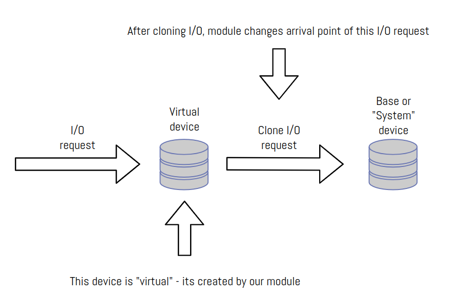

# LINUX KERNEL BLOCK DEVICE DRIVER

**Linux kernel version: 6.8**
**Linux distribution: Ubuntu Server LTS 22.02**

## Simple idea
This driver creates simple virtual block devise (to be more precise, the disk). This disk takes all IO requests and redirects them to any block device in your system.

## Log-structuring
Main idea of this work is to develop module that will readress all IO requests. "**Log structured**" means that the way we redirect all requests will change 